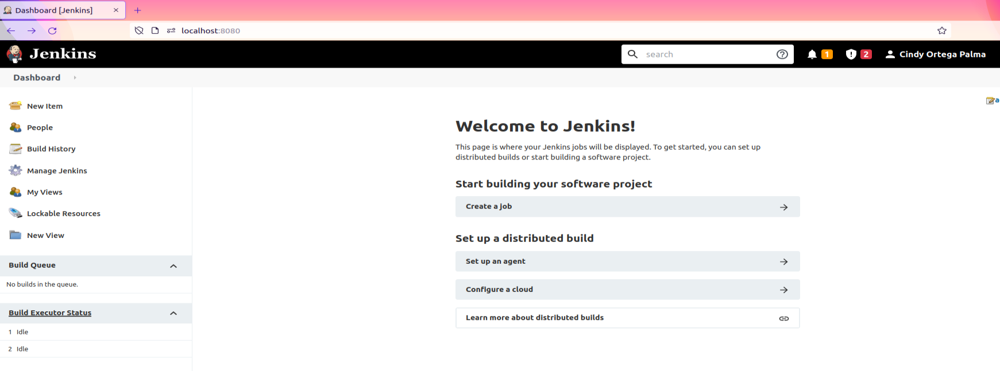
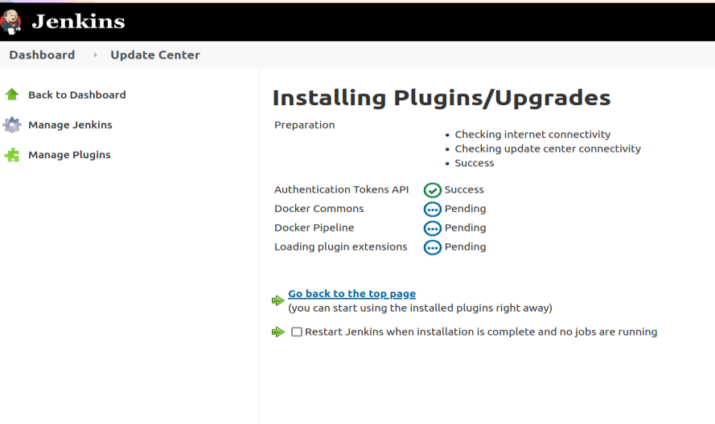
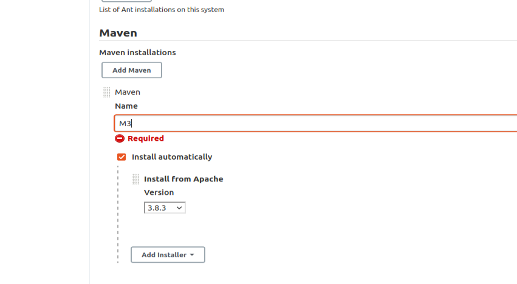
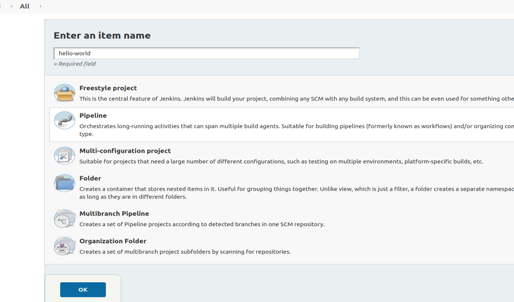
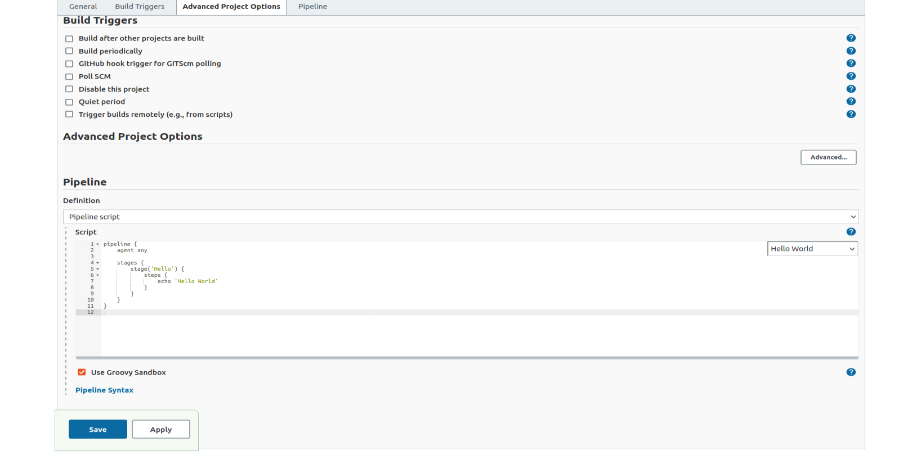
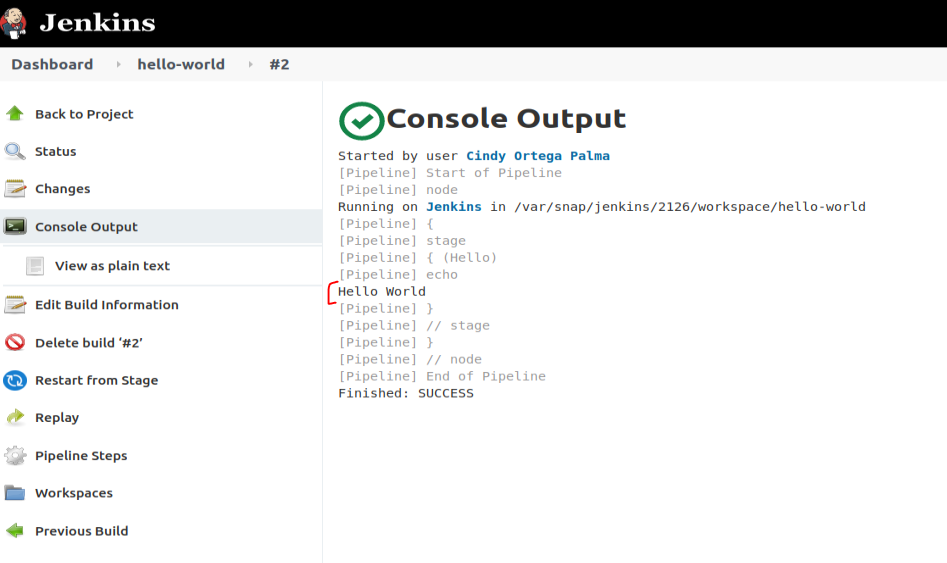
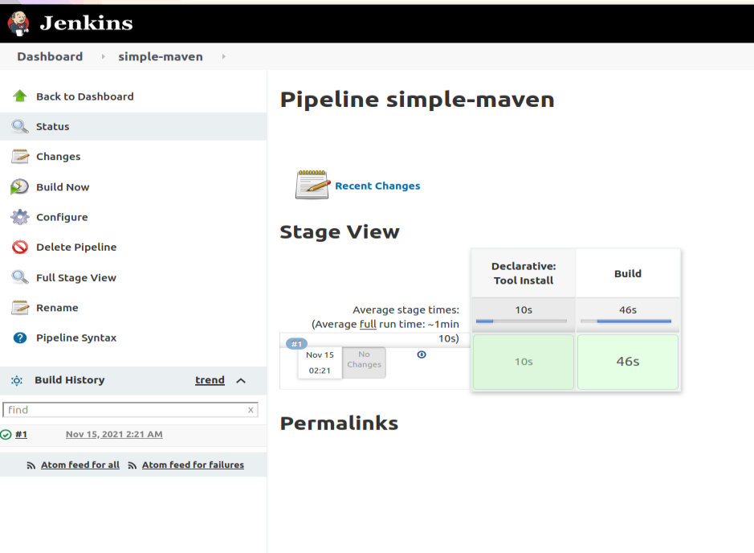
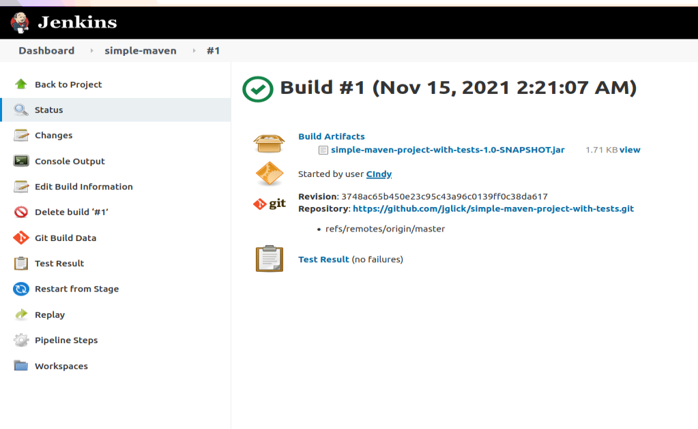
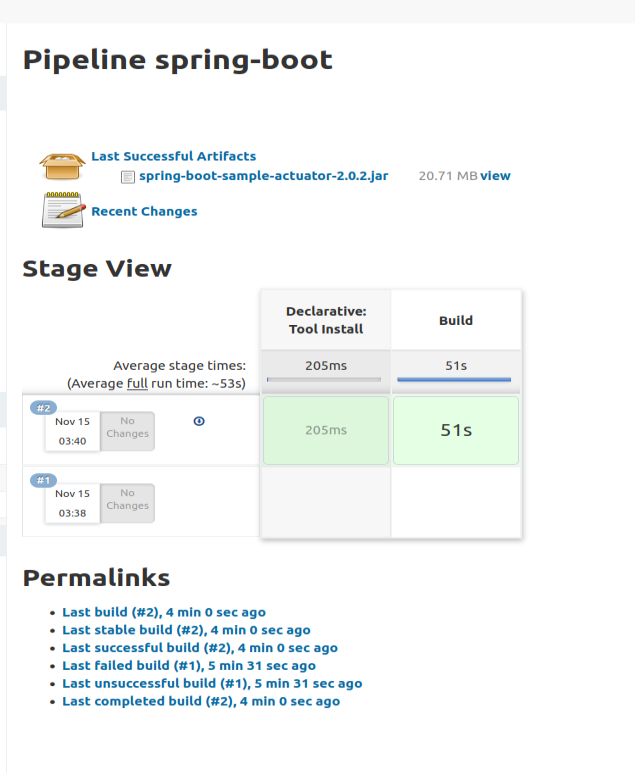
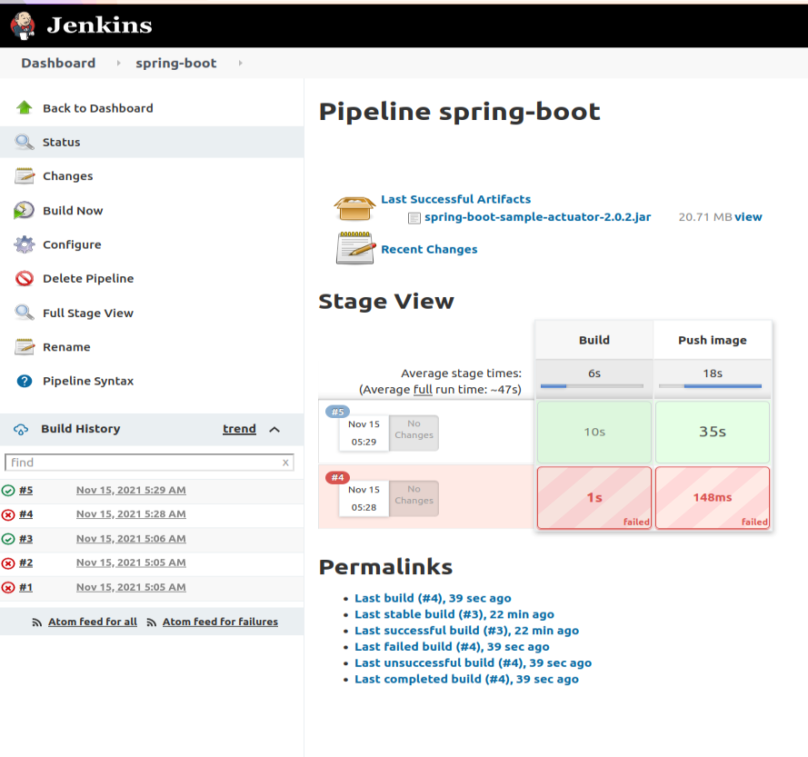

## ACTIVIDADES

* Jenkins instalado
 

### 3- Instalando Plugins y configurando herramientas
* En Administrar Jenkins vamos a la sección de Administrar Plugins
* De la lista de plugins disponibles instalamos Docker Pipeline

 

* Instalamos sin reiniciar el servidor.
* Abrir nuevamente página de Plugins y explorar la lista, para familiarizarse qué tipo de plugins hay disponibles.
* En la sección de administración abrir la opción de configuración de herramientas
Agregar maven con el nombre de M3 y que se instale automáticamente.

 

### 4- Creando el primer Pipeline Job
* Crear un nuevo item, del tipo Pipeline con nombre hello-world

 

* Una vez creado el job, en la sección Pipeline seleccionamos try sample Pipeline y luego Hello World

 

 

* Guardamos y ejecutamos el Job
* Analizar la salida del mismo

 
Me generó una lista de pasos que se llaman estados, donde el estado se llamaba Hello y corrió la task, entonces así puedo ir armando el pipeline 

### 5- Creando un Pipeline Job con Git y Maven
* Similar al paso anterior creamos un ítem con el nombre simple-maven
* Elegir Git + Maven en la sección try sample Pipeline
* Guardar y ejecutar el Job
* Analizar el script, para identificar los diferentes pasos definidos y correlacionarlos con lo que se ejecuta en el Job y se visualiza en la página del Job.

Lo que hace el código de git + maven es
1. Se descarga el repo de git
2. cln package, se limpia el paquete. Esperamos un .jar de salida
3. Al final de la ejecucion va a juntar todos los resultados del test cases q se generan como parte de la ejecucion de ese cln package, usando el plugin Junit
4. archiveArtifacs va a guardar todo lo que se genera en la carpeta target directamente en Jenkins para que despues yo los pueda utilizar para algo. Para bajarlo, o para pasarlo a otro Pipeline como entrada al artefacto.


 
 

### 6- Utilizando nuestros proyectos
* Utilizando lo aprendido en el ejercicio 5
* Crear un Job que construya el proyecto spring-boot del trabajo práctico 6.
* Obtener el código desde el repositorio de cada alumno (se puede crear un repositorio nuevo en github que contenga solamente el proyecto maven).
* Generar y publicar los artefactos que se producen.

 

* Como resultado de este ejercicio proveer el script en un archivo spring-boot/Jenkinsfile

```
pipeline {
    agent any

    tools {
        maven "M3"
    }

    stages {
        stage('Build') {
            steps {
                git(url: 'https://github.com/cindyortega416/spring-boot.git', branch: 'master', poll: true)
                sh 'mvn -Dmaven.test.failure.ignore=true clean package'
            }

            post {
                success {
                    archiveArtifacts 'target/*.jar'
                }
            }
        }
    }
} 
```

7- Utilizando nuestros proyectos con Docker
* Extender el ejercicio 6
* Generar y publicar en Dockerhub la imagen de docker ademas del Jar.
* Se puede utilizar el plugin de docker o comandos de shell.
* No poner usuario y password en el pipeline en texto plano, por ejemplo para conectarse a DockerHub, utilizar credenciales de jenkins en su lugar.

 Configuramos las credenciales n jenkins para que pueda acceder a dockerhub

* Como resultado de este ejercicio proveer el script en un archivo spring-boot/Jenkinsfile

 

```
pipeline {
    agent any

    environment { 
        registry = "cindy416/spring-boot" 
        registryCredential = 'docker-hub-credentials' 
    }
    
    
    stages {
        stage('Build') {
            steps {
                git(url: 'https://github.com/CindyOrtega416/spring-boot.git', branch: 'master', poll: true)
                sh 'docker build -t $registry:$BUILD_ID .'
            }
        }
        
        stage('Push image') {
            steps {
                withCredentials([usernamePassword( credentialsId: 'docker-hub-credentials', usernameVariable: 'USERNAME', passwordVariable: 'PASSWORD')]) {
                    script {
                        docker.withRegistry('', 'docker-hub-credentials') {
                            sh "docker login -u ${USERNAME} -p ${PASSWORD}"
                            sh "docker push $registry:$BUILD_ID"
                        }   
                    }
                }   
            }
        }
    }
} 

